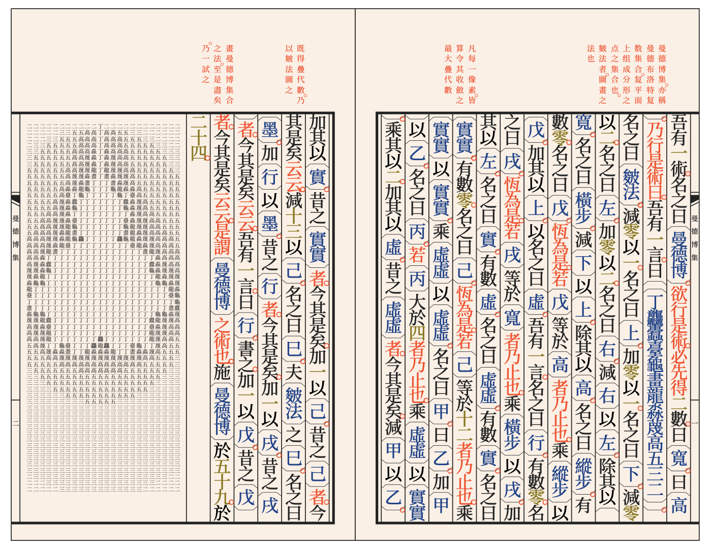
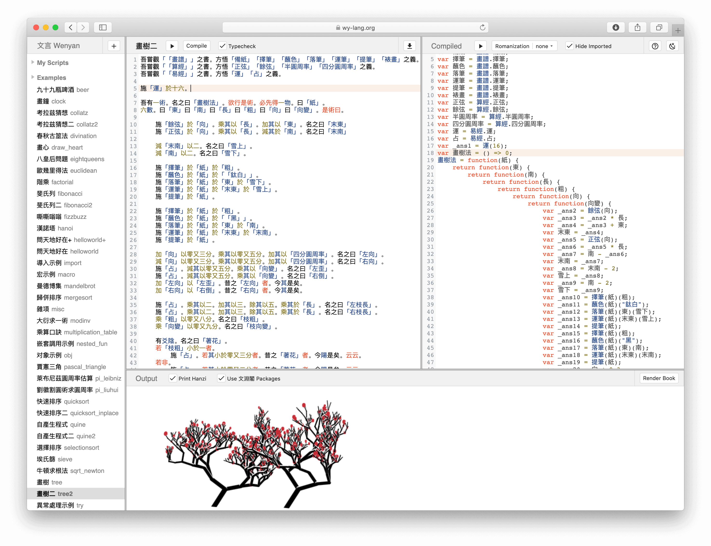

# 文言 wenyan-lang

[](https://www.npmjs.com/package/@wenyanlang/core)
[](https://github.com/LingDong-/wenyan-lang/actions)
[](https://app.netlify.com/sites/wenyan-lang/deploys)

### [wy-lang.org](https://wy-lang.org) | [Wiki](https://github.com/wenyan-lang/wenyan/wiki)

English | [简体中文](./README.zh-Hans.md) | [繁体中文](./README.zh-Hant.md)

文言文編程語言。A programming language for the ancient Chinese. [Try it online.](https://wy-lang.org/ide)



[**CHANGELOG**](./CHANGELOG.md)

## 序

> 夫[唐](https://en.wikipedia.org/wiki/Emperor_Yao)、[虞](https://en.wikipedia.org/wiki/Emperor_Shun)之世，[結繩而足治](https://ctext.org/book-of-changes/xi-ci-xia/zh)，屈指而足算。是時豈料百代之後，計算機械之巧，精於[公輸](https://en.wikipedia.org/wiki/Lu_Ban)之[木鳶](https://en.wikipedia.org/wiki/Lu_Ban#Inventions)，善於[武侯](https://en.wikipedia.org/wiki/Zhuge_Liang)之[流馬](https://en.wikipedia.org/wiki/Wooden_ox)；程式語言之多，繁若[《天官》](https://ctext.org/shiji/tian-guan-shu/zh)之星宿，奇勝[《山經》](https://en.wikipedia.org/wiki/Classic_of_Mountains_and_Seas)之走獸。[鼠](https://golang.org/)、[蟹](https://www.rust-lang.org/)、[鑽](http://ruby-lang.org/)、[魚](https://fishshell.com/)，或以速稱。[蛇](https://www.python.org/)、[象](https://www.php.net/)、[駱](https://www.perl.org/)、[犀](http://shop.oreilly.com/product/9780596805531.do)，各爭文采。方知[鬼之所以夜哭，天之所以雨粟](https://ctext.org/huainanzi/ben-jing-xun/zh)。然以文言編程者 ，似所未有。此誠非文脈之所以傳，文心之所以保。[嗟予小子](https://zh.wikisource.org/zh-hant/%E6%A6%AE%E6%9C%A8_(%E9%99%B6%E6%B7%B5%E6%98%8E))，遂有斯志。然則數寸之烏絲猶覆於頭，[萬卷之素書未破於手](https://zh.wikisource.org/zh-hant/%E5%A5%89%E8%B4%88%E9%9F%8B%E5%B7%A6%E4%B8%9E%E4%B8%88%E4%BA%8C%E5%8D%81%E4%BA%8C%E9%9F%BB)；一身長羈於遠邦，兩耳久曠于[雅言](https://zh.wikipedia.org/wiki/%E9%9B%85%E9%9F%B3)。然夫文章者吾之所宿好，程式者偶承時人之謬譽。故[希孟](https://en.wikipedia.org/wiki/Wang_Ximeng)不慚年少，[莊生](https://en.wikipedia.org/wiki/Zhuang_Zhou)不望[無涯](https://ctext.org/zhuangzi/nourishing-the-lord-of-life/zh)。乃作斯言。誠未能嘔瀝[長吉](https://en.wikipedia.org/wiki/Li_He)之[心血](https://zh.wikisource.org/zh-hant/%E6%9D%8E%E8%B3%80%E5%B0%8F%E5%82%B3)，亦庶幾免於[義山](https://en.wikipedia.org/wiki/Li_Shangyin)之[流沫](https://zh.wikisource.org/zh-hant/%E9%9F%93%E7%A2%91)。既成之後，復學[干將鑄劍](https://zh.wikisource.org/wiki/%E9%91%84%E5%8A%8D)而自飼，[越王嚐糞](https://ctext.org/wu-yue-chun-qiu/yue-wang-gou-jian-wu-nian/zh)而當先。自謂偶追[《十書》](https://en.wikipedia.org/wiki/Ten_Computational_Canons)之筆意，但恨少[八家](https://en.wikipedia.org/wiki/Eight_Masters_of_the_Tang_and_Song)之淋漓。此[子山](https://en.wikipedia.org/wiki/Yu_Xin)所謂[士衡撫掌而甘心，平子見陋而固宜](https://zh.wikisource.org/zh-hant/%E5%93%80%E6%B1%9F%E5%8D%97%E8%B3%A6)。然則雖實[覆甕](https://zh.wikisource.org/zh-hant/%E6%99%89%E6%9B%B8/%E5%8D%B7092#%E5%B7%A6%E6%80%9D)之質，尚存斧正之望；雖乏[呂相](https://en.wikipedia.org/wiki/L%C3%BC_Buwei)之金，[易字](https://zh.wikisource.org/zh/%E5%8F%B2%E8%A8%98/%E5%8D%B7085)之渴蓋同。此亦開源之大義，吾輩之所以勉勵也。一笑。

## Helloworld

Wenyan:

```
吾有一數。曰三。名之曰「甲」。
為是「甲」遍。
	吾有一言。曰「「問天地好在。」」。書之。
云云。
```
Equivalent JavaScript:

```JavaScript
var n = 3;
for (var i = 0; i < n; i++) {
	console.log("問天地好在。");
}
```

Output:

```
問天地好在。
問天地好在。
問天地好在。
```

Punctuations and newlines are completely optional (just like they are in Classical Chinese), so the above code is equivalent to:

```
吾有一數曰三名之曰「甲」為是「甲」遍吾有一言曰「「問天地好在」」書之云云
```

More sophisticated examples, such as the Sieve of Eratosthenes, Quicksort, Mandelbrot set, and Tower of Hanoi, can be found in the `./examples` folder.

## Features
- [Natural Language Programming](https://en.wikipedia.org/wiki/Natural-language_programming) sharing the grammar of [Classical Chinese](https://en.wikipedia.org/wiki/Classical_Chinese)
- Compiles to [JavaScript](https://developer.mozilla.org/en-US/docs/Web/JavaScript), [Python](https://python.org), or [Ruby](http://ruby-lang.org)
- [Turing complete](https://github.com/LingDong-/wenyan-lang/blob/master/examples/turing.wy)
- An [Online IDE](https://wy-lang.org/ide)
- [Examples](https://github.com/LingDong-/wenyan-lang/tree/master/examples) to get started

## Try it out

### [The Online IDE](https://wy-lang.org/ide)



### Text Editor Plugins

- [Plugin for VSCode](https://github.com/antfu/wenyan-lang-vscode) by [antfu](https://github.com/antfu)
- [Plugin for Vim](https://github.com/voldikss/vim-wenyan) by [voldikss](https://github.com/voldikss)
- [Plugin for Sublime Text](https://github.com/absop/SublimeWenyan) by [absop](https://github.com/absop)

### Command Line Compiler

Install the compiler by

```bash
npm install -g @wenyanlang/cli
```

Try run the included examples, e.g.:

```bash
wenyan examples/helloworld.wy
# will outputs: 問天地好在。
```

### [The Decompiler](https://zxch3n.github.io/wenyanizer/)

You can now translate JavaScript to wenyan-lang using the [wenyanizer](https://github.com/zxch3n/wenyanizer) by [zxch3n](https://github.com/zxch3n).

### 3rd Party Compilers

- [JVM compiler](https://github.com/MagicLu550/wenyan-lang_jvm) by [MagicLu550](https://github.com/MagicLu550)

## Documentation

Check out our [Wiki pages](https://github.com/wenyan-lang/wenyan/wiki)

- [Syntax Cheatsheet](https://github.com/wenyan-lang/wenyan/wiki/Syntax-Cheatsheet)
- [Standard Library Cheatsheet](https://github.com/wenyan-lang/wenyan/wiki/Standard-Library-Cheatsheet)
- [API Specifcations](https://github.com/wenyan-lang/wenyan/wiki/Compiler-API)
- [Browser Runtime](https://github.com/wenyan-lang/wenyan/wiki/Browser-Runtime)
- [Feature Requests](https://github.com/wenyan-lang/wenyan/wiki/Feature-Requests)
- [Known Issues](https://github.com/wenyan-lang/wenyan/wiki/Known-Issues)